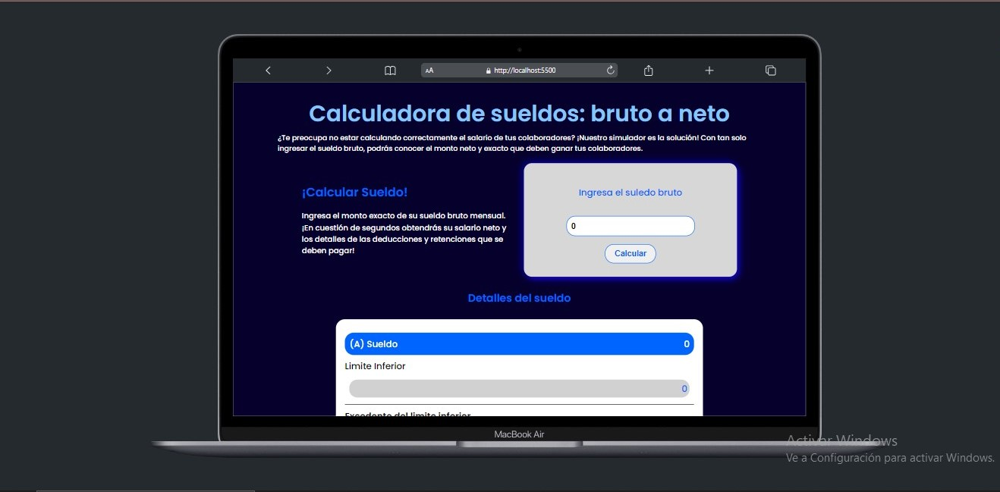

# SALARIO BRUTO A NETO 💵

**Bienvenido a este sitio para obtener el salario neto de un empleado a partir de el salario bruto**

**Este proyecto es realizado con base a los temas vistos en el curso de Platzi de la escuela de Desarrollo web (Taller de matematicas y estadistica basica con javascript) donde se vieron temas como traducir formulas matematicas a codigo JS y tambien la manipulacion de objetos y arrays**

## TECNOLIGIAS: 
- **HTML**
- **CSS**
- **JAVASCRIPT**

## Link:
**https://leonardo291024.github.io/sueldo_bruto_a_neto/**

;